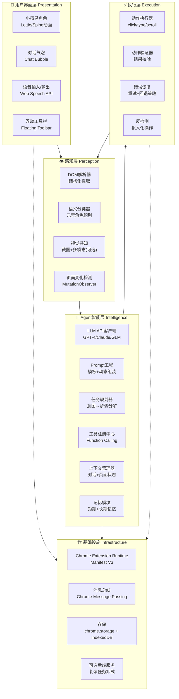
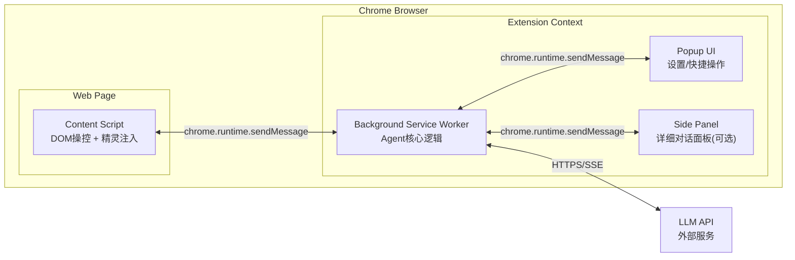
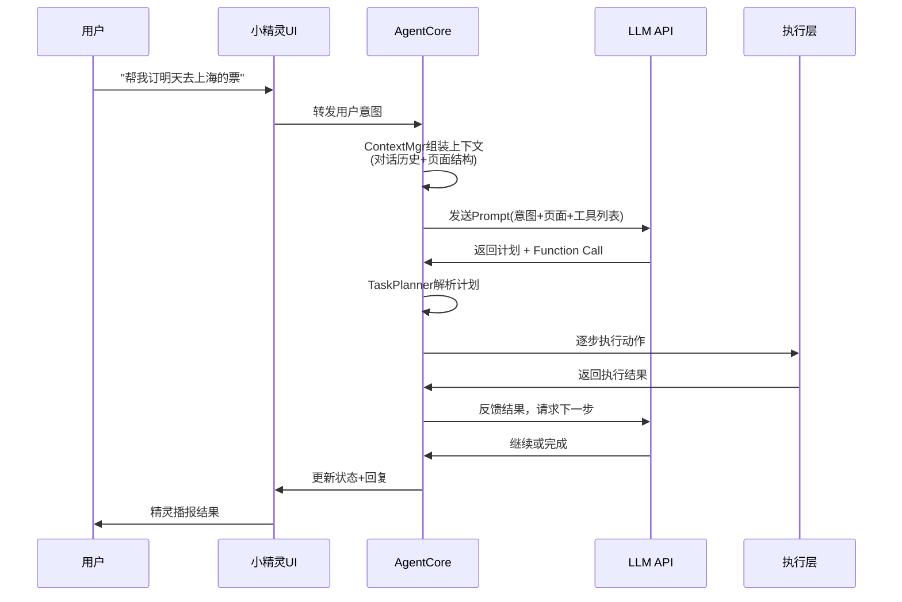
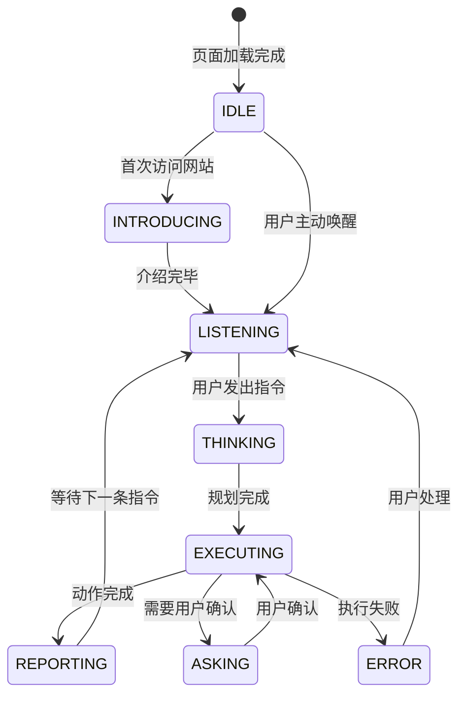
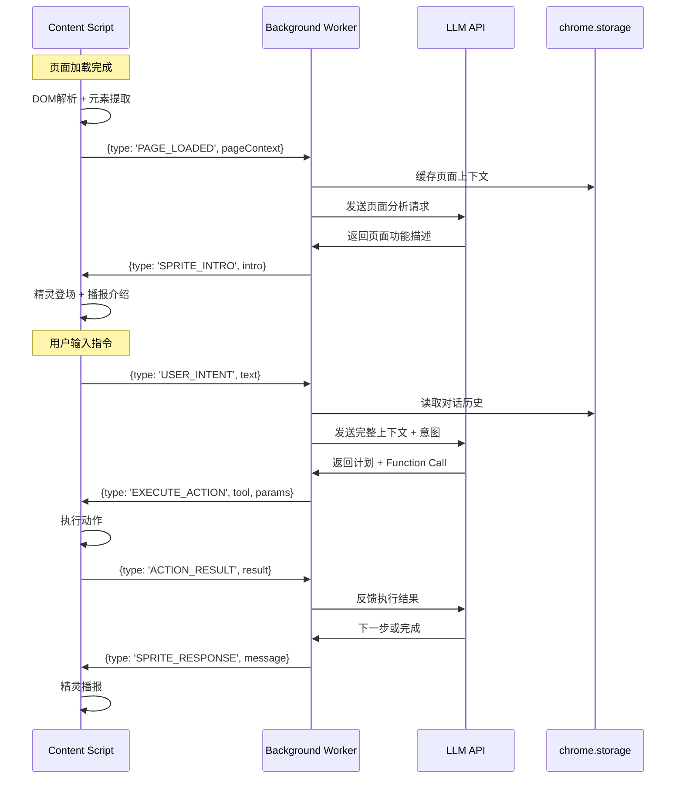

# 🧚 AUI (Agent UI) — 智能体浏览器助手 技术架构文档

> **版本**: v1.0  
> **状态**: 架构设计阶段  
> **定位**: 智能体大赛应用赛道参赛项目

---

## 目录

1. [产品概述](#1-产品概述)
2. [系统总体架构](#2-系统总体架构)
3. [核心模块详细设计](#3-核心模块详细设计)
4. [数据流与通信协议](#4-数据流与通信协议)
5. [技术选型](#5-技术选型)
6. [安全与隐私方案](#6-安全与隐私方案)
7. [开发路线图](#7-开发路线图)
8. [风险与应对](#8-风险与应对)

---

## 1. 产品概述

### 1.1 一句话描述

> 一个浏览器扩展形态的 AI Agent，为任意网站覆盖一层"智能膜"——通过一个可视化小精灵角色，让用户用自然语言完成网站上的所有操作。

### 1.2 核心场景

| 场景 | 用户行为 | Agent 行为 |
|------|---------|-----------|
| 🚂 订票 | 打开12306 → "帮我订一张明天北京到上海的高铁" | 识别出发地/目的地/日期 → 自动填写 → 筛选车次 → 引导支付 |
| 🛒 购物 | 打开淘宝 → "帮我找500以内评分最高的蓝牙耳机" | 搜索 → 筛选价格 → 按评分排序 → 展示Top3 |
| 📝 填表 | 打开政务网站 → "帮我填这个申请表" | 解析表单字段 → 逐项询问 → 自动填写提交 |
| 📖 信息获取 | 打开技术文档 → "总结这一页的核心内容" | 提取正文 → LLM总结 → 精灵播报 |

### 1.3 差异化亮点（竞赛加分项）

- **可视化精灵角色**：不是冷冰冰的对话框，而是一个有性格、有动画的虚拟角色
- **"膜"的隐喻**：精灵悬浮在网页之上，不侵入、不破坏，像一层智能保护膜
- **推理过程可视化**：展示 Agent 如何"看懂"网页 → "规划"步骤 → "执行"操作
- **通用性设计**：不针对特定网站硬编码，依赖 LLM 的通用理解能力

---

## 2. 系统总体架构

### 2.1 分层架构图



### 2.2 Chrome Extension 组件拓扑



---

## 3. 核心模块详细设计

### 3.1 感知层 — [`PagePerceptionModule`](src/perception/PagePerception.ts)

#### 职责
将任意网页的 DOM 结构转化为 LLM 可理解的语义化描述。

#### 核心流程

```
原始DOM → 清洗(去广告/脚本) → 结构化提取 → 语义标注 → 压缩上下文 → 输出给LLM
```

#### 提取策略

| 提取内容 | 方法 | 输出格式 |
|---------|------|---------|
| 页面标题/描述 | `document.title` + meta tags | `{title, description}` |
| 可交互元素 | 遍历 `a/button/input/select/textarea` | `[{tag, type, text, ariaLabel, id, rect}]` |
| 表单结构 | 识别 `form` → 提取字段列表 | `[{label, inputType, required, options}]` |
| 内容区域 | 识别 `main/article/section` | `[{role, textSummary, childCount}]` |
| 导航结构 | 识别 `nav` → 提取链接列表 | `[{text, href}]` |

#### 关键代码结构

```typescript
interface PageContext {
  url: string;
  title: string;
  description: string;
  interactiveElements: InteractiveElement[];
  forms: FormSchema[];
  contentBlocks: ContentBlock[];
  navigation: NavItem[];
  screenshot?: string; // base64, 可选
}

interface InteractiveElement {
  tag: string;           // 'button' | 'a' | 'input' | 'select'
  type: string;          // 'submit' | 'text' | 'checkbox'
  text: string;          // 可见文本
  ariaLabel: string;     // 无障碍标签
  selector: string;      // 唯一CSS选择器（用于后续操作）
  boundingBox: DOMRect;  // 位置信息
  disabled: boolean;
  visible: boolean;
}
```

#### 上下文压缩策略

LLM 的 context window 有限，需要对页面信息进行智能压缩：

1. **可见性过滤**：只提取视口内可见元素
2. **重要性排序**：表单 > 按钮 > 链接 > 文本
3. **相似元素合并**：列表项合并为摘要
4. **Token预算控制**：单次上下文不超过 4000 tokens

---

### 3.2 Agent 智能层 — [`AgentCore`](src/agent/AgentCore.ts)

#### 3.2.1 整体架构



#### 3.2.2 Prompt 工程设计

采用 **分层 Prompt 架构**：

```
┌──────────────────────────────────────┐
│  System Prompt (固定，约800 tokens)   │
│  - 角色定义：你是网站助手小精灵       │
│  - 行为准则：安全、准确、友好         │
│  - 输出格式：JSON + Function Call     │
├──────────────────────────────────────┤
│  Page Context (动态，约2000 tokens)   │
│  - 当前页面URL/标题/描述              │
│  - 可交互元素列表                     │
│  - 表单结构                           │
│  - 页面内容摘要                       │
├──────────────────────────────────────┤
│  Conversation History (滑动窗口)      │
│  - 最近5轮对话                       │
│  - 已执行的动作记录                   │
├──────────────────────────────────────┤
│  User Intent (当前用户输入)           │
└──────────────────────────────────────┘
```

#### 3.2.3 Function Calling / Tool Use 设计

Agent 通过 Function Calling 机制操控网页：

```typescript
const TOOL_DEFINITIONS = [
  {
    name: "click_element",
    description: "点击页面上的一个元素",
    parameters: {
      selector: "CSS选择器，从页面元素列表中选取",
      reason: "点击原因"
    }
  },
  {
    name: "type_text",
    description: "在输入框中输入文本",
    parameters: {
      selector: "目标输入框的CSS选择器",
      text: "要输入的文本内容",
      submit: "输入后是否提交（回车）"
    }
  },
  {
    name: "select_option",
    description: "在下拉框中选择选项",
    parameters: {
      selector: "下拉框的CSS选择器",
      value: "选项的值或文本"
    }
  },
  {
    name: "scroll_page",
    description: "滚动页面",
    parameters: {
      direction: "'up' | 'down'",
      amount: "滚动像素数"
    }
  },
  {
    name: "wait_for",
    description: "等待页面加载或变化",
    parameters: {
      condition: "'navigation' | 'element' | 'timeout'",
      selector: "等待的元素选择器（condition=element时）",
      timeout: "超时毫秒数"
    }
  },
  {
    name: "extract_info",
    description: "从页面提取特定信息",
    parameters: {
      query: "要提取的信息描述",
      selector: "可选，限定提取范围"
    }
  },
  {
    name: "ask_user",
    description: "需要用户确认或补充信息时调用",
    parameters: {
      question: "向用户提出的问题",
      options: "可选项列表（可选）"
    }
  },
  {
    name: "complete_task",
    description: "任务完成，汇报结果",
    parameters: {
      summary: "任务完成摘要",
      next_suggestions: "建议的后续操作"
    }
  }
];
```

#### 3.2.4 任务规划器 — [`TaskPlanner`](src/agent/TaskPlanner.ts)

将用户意图分解为可执行的步骤序列：

```
用户意图: "帮我订明天北京到上海的高铁"
        ↓
步骤1: 确认出发地输入框 → 填入"北京"
步骤2: 确认目的地输入框 → 填入"上海"  
步骤3: 确认日期选择器 → 选择明天日期
步骤4: 点击"查询"按钮
步骤5: 等待结果加载
步骤6: 分析车次列表 → 筛选高铁
步骤7: 展示Top3选项给用户
步骤8: 等待用户选择 → 点击预订
```

#### 3.2.5 上下文管理器 — [`ContextManager`](src/agent/ContextManager.ts)

```typescript
interface AgentState {
  sessionId: string;
  pageUrl: string;
  conversationHistory: Message[];
  actionHistory: ActionRecord[];
  currentTask: Task | null;
  pageContext: PageContext;
  userPreferences: UserPreferences;
}

interface ActionRecord {
  timestamp: number;
  tool: string;
  params: Record<string, any>;
  result: 'success' | 'failure' | 'pending';
  screenshot?: string; // 执行前后截图
  error?: string;
}
```

---

### 3.3 小精灵 UI 层 — [`SpriteUI`](src/ui/SpriteUI.tsx)

#### 3.3.1 视觉设计

```
┌─────────────────────────────────────┐
│          🌐 原始网页                  │
│                                     │
│    ┌──────────────────────┐         │
│    │  [网站正常内容...]     │         │
│    │                      │         │
│    │                      │         │
│    │              ┌────┐  │         │
│    │              │🧚 │  │ ← 小精灵（可拖拽）  │
│    │              └─┬─┘  │         │
│    │       ┌────────┴────┐│         │
│    │       │ 对话气泡     ││         │
│    │       │ 你好！这个  ││         │
│    │       │ 网站可以... ││         │
│    │       └─────────────┘│         │
│    └──────────────────────┘         │
└─────────────────────────────────────┘
```

#### 3.3.2 精灵状态机



#### 3.3.3 动画设计

| 状态 | 动画 | 描述 |
|------|------|------|
| IDLE | 呼吸/漂浮 | 精灵微微上下浮动 |
| INTRODUCING | 挥手/登场 | 从边缘飞入，挥手致意 |
| LISTENING | 倾听 | 身体前倾，耳朵变大 |
| THINKING | 思考 | 转圈/摸下巴 |
| EXECUTING | 忙碌 | 快速飞行/施法 |
| REPORTING | 展示 | 摊手/指向结果 |
| ERROR | 沮丧 | 低头/冒汗 |

#### 3.3.4 技术实现

- **动画引擎**：Lottie (JSON动画) 或 Spine (骨骼动画)
- **渲染方式**：Canvas 或 CSS Animation
- **注入方式**：Content Script 创建 Shadow DOM，隔离样式
- **可拖拽**：支持用户拖动精灵到任意位置

---

### 3.4 执行层 — [`ActionExecutor`](src/execution/ActionExecutor.ts)

#### 3.4.1 动作执行流程

```typescript
class ActionExecutor {
  async execute(tool: string, params: Record<string, any>): Promise<ActionResult> {
    // 1. 前置检查：元素是否存在且可交互
    await this.preCheck(params.selector);
    
    // 2. 高亮目标元素（给用户视觉反馈）
    await this.highlightElement(params.selector);
    
    // 3. 拟人化延迟（避免被检测为机器人）
    await this.humanDelay();
    
    // 4. 执行动作
    const result = await this.dispatch(tool, params);
    
    // 5. 截图验证（可选）
    const afterScreenshot = await this.captureScreenshot();
    
    // 6. 结果校验
    await this.validateResult(tool, params, result);
    
    return { success: true, afterScreenshot };
  }
}
```

#### 3.4.2 拟人化操作策略

```typescript
// 模拟人类操作特征
const humanLikeBehavior = {
  // 随机延迟 200-800ms
  delay: () => 200 + Math.random() * 600,
  
  // 打字速度：每个字符 50-150ms，偶尔停顿
  typingSpeed: () => 50 + Math.random() * 100,
  
  // 鼠标移动：贝塞尔曲线而非直线
  mousePath: (from, to) => generateBezierPath(from, to),
  
  // 偶尔的"犹豫"：悬停后取消再点
  hesitation: () => Math.random() < 0.05,
};
```

#### 3.4.3 错误恢复策略

```
执行失败
  ├── 元素未找到 → 重新提取页面结构 → 重试（最多3次）
  ├── 元素被遮挡 → 滚动到可见区域 → 重试
  ├── 页面未加载 → 等待 → 重试
  ├── 验证码出现 → 暂停 → 通知用户手动处理
  └── 未知错误 → 截图 → 回退到上一步 → 请求LLM重新规划
```

---

## 4. 数据流与通信协议

### 4.1 完整数据流



### 4.2 消息协议定义

```typescript
// Content Script → Background
type CSMessage = 
  | { type: 'PAGE_LOADED'; pageContext: PageContext }
  | { type: 'PAGE_CHANGED'; changes: PageChange[] }
  | { type: 'USER_INTENT'; text: string; voice?: boolean }
  | { type: 'ACTION_RESULT'; actionId: string; result: ActionResult }
  | { type: 'USER_INTERRUPT'; reason: string };

// Background → Content Script  
type BGMessage =
  | { type: 'SPRITE_INTRO'; intro: string; suggestions: string[] }
  | { type: 'SPRITE_RESPONSE'; message: string; emotion: Emotion }
  | { type: 'EXECUTE_ACTION'; actionId: string; tool: string; params: any }
  | { type: 'HIGHLIGHT_ELEMENT'; selector: string }
  | { type: 'UPDATE_SPRITE_STATE'; state: SpriteState };
```

### 4.3 存储设计

```typescript
// chrome.storage.local — 持久化数据
interface PersistentStorage {
  userPreferences: {
    llmProvider: 'openai' | 'claude' | 'glm';
    apiKey: string; // 加密存储
    spriteCharacter: string; // 精灵角色选择
    language: 'zh-CN' | 'en-US';
    autoActivate: boolean; // 是否自动激活
  };
  siteKnowledge: Record<string, { // 按域名缓存
    lastVisit: number;
    pageSchema: PageContext;
    commonTasks: string[];
  }>;
  actionHistory: ActionRecord[]; // 最近100条
}

// IndexedDB — 大量数据
interface IndexedDBStorage {
  conversationLogs: ConversationLog[]; // 完整对话记录
  screenshots: ScreenshotRecord[]; // 截图存档
}
```

---

## 5. 技术选型

### 5.1 前端技术栈

| 层级 | 技术 | 选型理由 |
|------|------|---------|
| Extension框架 | Chrome Manifest V3 | 最新标准，强制要求 |
| UI框架 | Preact (3KB) | 轻量，适合注入网页 |
| 精灵动画 | Lottie-web | JSON驱动，设计师友好 |
| 语音识别 | Web Speech API | 浏览器原生，无需额外依赖 |
| 语音合成 | Web Speech API / ElevenLabs | 原生TTS或高质量TTS |
| 样式方案 | CSS Modules + Shadow DOM | 样式隔离，不污染宿主页面 |
| 构建工具 | Vite + @crxjs/vite-plugin | 快速HMR，Extension专用插件 |

### 5.2 LLM 选型

| 模型 | 优势 | 劣势 | 推荐场景 |
|------|------|------|---------|
| **GPT-4o** | 最强综合能力，Function Calling成熟 | 成本较高，需翻墙 | 主力推理引擎 |
| **Claude 3.5 Sonnet** | 长上下文，安全性好 | Function Calling略弱 | 复杂页面分析 |
| **GLM-4 / 通义千问** | 国内可直接访问，中文优化 | Function Calling能力待验证 | 国内部署首选 |
| **DeepSeek-V3** | 性价比极高，中文强 | 稳定性待观察 | 成本敏感场景 |

**推荐策略**：支持多Provider切换，默认使用 GPT-4o，提供国内模型备选。

### 5.3 开发工具链

| 工具 | 用途 |
|------|------|
| TypeScript 5.x | 类型安全 |
| ESLint + Prettier | 代码规范 |
| Vitest | 单元测试 |
| Playwright | E2E测试（模拟网页交互） |
| MSW | API Mock |

---

## 6. 安全与隐私方案

### 6.1 安全威胁模型

```
┌────────────────────────────────────────────┐
│  威胁                          │  风险等级  │
├────────────────────────────────────────────┤
│  API Key泄露                   │  🔴 高    │
│  敏感页面内容上传到LLM         │  🔴 高    │
│  恶意网站利用Agent执行攻击     │  🟡 中    │
│  XSS通过精灵UI注入             │  🟡 中    │
│  用户隐私数据被记录            │  🟡 中    │
│  Agent被检测导致账号封禁       │  🟢 低    │
└────────────────────────────────────────────┘
```

### 6.2 防护措施

#### API Key 安全
```typescript
// 使用 chrome.storage.local 加密存储
// 加密密钥由用户设定（PIN码或生物识别）
class SecureKeyStore {
  async storeApiKey(provider: string, key: string, pin: string): Promise<void> {
    const encrypted = await this.encrypt(key, pin);
    await chrome.storage.local.set({ [`apikey_${provider}`]: encrypted });
  }
  
  async getApiKey(provider: string, pin: string): Promise<string> {
    const { [`apikey_${provider}`]: encrypted } = await chrome.storage.local.get(`apikey_${provider}`);
    return this.decrypt(encrypted, pin);
  }
}
```

#### 敏感内容过滤
```typescript
// 在发送给LLM之前，过滤敏感字段
const SENSITIVE_PATTERNS = [
  /password/i,
  /credit.?card/i,
  /ssn/i,
  /身份证/i,
  /银行卡/i,
  /密码/i,
];

function sanitizePageContext(context: PageContext): PageContext {
  return {
    ...context,
    interactiveElements: context.interactiveElements.map(el => ({
      ...el,
      // 密码字段只保留类型信息，不保留值
      value: el.type === 'password' ? '[REDACTED]' : el.value,
    }))
  };
}
```

#### 域名白名单
```typescript
// 用户可配置哪些网站允许Agent激活
const DEFAULT_ALLOWED_DOMAINS = ['*']; // 默认全部允许
const DEFAULT_BLOCKED_DOMAINS = [
  'mail.google.com',
  'outlook.live.com',
  // 银行网站等
];
```

---

## 7. 开发路线图

### Phase 0: 原型验证（MVP）

```
目标：证明核心链路可行
```

- [ ] Chrome Extension 骨架搭建（Manifest V3 + Vite）
- [ ] Content Script 基础 DOM 提取
- [ ] 简单的 LLM API 调用（硬编码 Prompt）
- [ ] 基础精灵 UI（静态图标 + 文字气泡）
- [ ] 手动触发：点击 → 分析 → 回复

### Phase 1: 核心能力

```
目标：完成"感知→推理→执行"闭环
```

- [ ] 完整的 DOM 感知模块（元素分类、语义标注）
- [ ] Prompt 工程体系（System Prompt + 动态上下文）
- [ ] Function Calling 集成（8个核心工具）
- [ ] 动作执行器（click/type/select/scroll）
- [ ] 精灵动画系统（Lottie，5种状态动画）
- [ ] 对话管理（多轮对话 + 上下文窗口）

### Phase 2: 体验打磨

```
目标：让产品可用、好用
```

- [ ] 精灵角色选择（多套皮肤）
- [ ] 语音输入/输出
- [ ] 推理过程可视化（展示Agent思考步骤）
- [ ] 错误恢复机制
- [ ] 拟人化操作（随机延迟、贝塞尔鼠标路径）
- [ ] 设置面板（API配置、精灵选择、域名管理）

### Phase 3: 竞赛准备

```
目标：打磨演示效果，准备竞赛材料
```

- [ ] 3-5个精心设计的Demo场景
- [ ] 演示视频录制
- [ ] 项目文档 + PPT
- [ ] 异常情况处理（断网、验证码、登录态）
- [ ] 性能优化（上下文压缩、缓存策略）

---

## 8. 风险与应对

| 风险 | 概率 | 影响 | 应对策略 |
|------|------|------|---------|
| LLM Function Calling 不稳定 | 中 | 高 | 增加重试机制 + fallback到纯文本解析 |
| 网站反自动化检测 | 高 | 中 | 拟人化操作 + 用户手动辅助模式 |
| 复杂页面DOM提取不完整 | 中 | 中 | 结合截图+多模态视觉理解 |
| API调用延迟影响体验 | 中 | 中 | 流式响应 + 精灵"思考中"动画过渡 |
| 竞赛时间不够 | 中 | 高 | MVP优先，砍非核心功能 |
| 国内LLM API不稳定 | 低 | 中 | 支持多Provider热切换 |

---

## 附录 A: 项目目录结构

```
AUI/
├── public/
│   ├── icons/                    # Extension图标
│   └── animations/               # Lottie动画JSON文件
│       ├── idle.json
│       ├── thinking.json
│       ├── executing.json
│       └── ...
├── src/
│   ├── manifest.json             # Chrome Extension配置
│   ├── background/               # Background Service Worker
│   │   ├── index.ts
│   │   ├── AgentCore.ts          # Agent核心逻辑
│   │   ├── TaskPlanner.ts        # 任务规划器
│   │   ├── ContextManager.ts     # 上下文管理
│   │   └── LLMClient.ts          # LLM API封装
│   ├── content/                  # Content Script
│   │   ├── index.ts
│   │   ├── perception/           # 感知模块
│   │   │   ├── DOMParser.ts
│   │   │   ├── ElementExtractor.ts
│   │   │   ├── SemanticClassifier.ts
│   │   │   └── PageChangeDetector.ts
│   │   ├── execution/            # 执行模块
│   │   │   ├── ActionExecutor.ts
│   │   │   ├── ActionValidator.ts
│   │   │   └── HumanLikeBehavior.ts
│   │   └── ui/                   # 精灵UI
│   │       ├── SpriteContainer.tsx
│   │       ├── SpriteCharacter.tsx
│   │       ├── ChatBubble.tsx
│   │       ├── VoiceInput.tsx
│   │       └── styles/
│   ├── popup/                    # Extension Popup
│   │   ├── index.html
│   │   ├── App.tsx
│   │   └── Settings.tsx
│   ├── shared/                   # 共享代码
│   │   ├── types.ts              # 类型定义
│   │   ├── constants.ts          # 常量
│   │   ├── message-protocol.ts   # 消息协议
│   │   └── utils/
│   └── storage/                  # 存储层
│       ├── SecureKeyStore.ts
│       └── StorageManager.ts
├── tests/
│   ├── unit/
│   └── e2e/
├── plans/
│   └── architecture-design.md    # 本文档
├── package.json
├── tsconfig.json
├── vite.config.ts
└── README.md
```

## 附录 B: 关键依赖

```json
{
  "dependencies": {
    "preact": "^10.x",
    "lottie-web": "^5.x",
    "openai": "^4.x",
    "@anthropic-ai/sdk": "^0.x",
    "idb": "^8.x"
  },
  "devDependencies": {
    "@crxjs/vite-plugin": "^2.x",
    "typescript": "^5.x",
    "vite": "^5.x",
    "vitest": "^1.x",
    "@playwright/test": "^1.x"
  }
}
```

---

> 📌 **下一步**：确认架构设计后，切换到 Code 模式开始 Phase 0 原型搭建。
